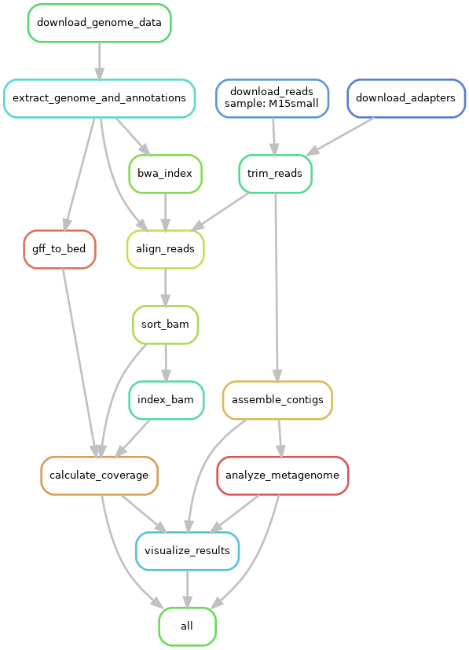

# Genomic Data Analysis Project

## Overview
### this project
This project focuses on the analysis of genomic data to identify genes, proteins, and other genomic features from metagenomic samples. Utilizing a suite of bioinformatics tools and R for data visualization, the pipeline processes raw sequencing reads, performs assembly, gene prediction, functional annotation, and visualizes key metrics such as contig lengths, GC content, and coverage.

### Original pipeline:
The article [2] describes the development of a pipeline designed to accelerate the analysis of next-generation sequencing (NGS) data. This pipeline allows for the reliable and clear presentation of results for identifying both new and known viruses from associated or environmental samples, with an emphasis on virus discovery. The data [3] used for this purpose was derived from diarrheic American mink (Neovison vison).


### Differences from the Original Pipeline:

This implementation diverges from the pipeline described in the original article in several ways. Notably, this project encompasses the stages up to and including the assembly of contigs, followed by an analysis using Prodigal instead of MGA. The substitution of MGA with Prodigal was necessitated by compatibility issues encountered with the combination of software packages and their respective versions specified in this project. Furthermore, subsequent steps outlined in the original pipeline, which extend beyond the contigs analysis, have been excluded due to the time constraints associated with this project.

Additionally, this version incorporates a visualization step, which is absent in the original pipeline. This inclusion aims to enhance the interpretability of the results, thereby adding value to the analytical process carried out in this school project.

## Getting Started

### Prerequisites
- Conda environment
- Python 3.6.13
- R 4.1.0
- Snakemake
- Bioinformatics tools: BWA, Samtools, MegaHit, Trimmomatic, Prodigal
- NCBI datasets CLI

### Installation

1. **Clone the Project Repository**:
   If you haven't already, start by cloning the project repository and navigate to the project directory:

```bash
git clone https://github.com/Mpslik/Dataprocessing
cd Dataprocessing/
```
2. **Create and Activate the Conda Environment**:
Utilize the `environment.yml` file provided in the repository to create an isolated Conda environment that contains all the packages needed for this project:

```bash
conda env create -f environment.yml
conda activate ngs-analysis-core
```
Ensure to activate the environment each time you work on the project to access the necessary tools and libraries.

### Verifying the Installation
To confirm the environment has been set up correctly and all packages are installed:

```bash
conda list
```

This command displays all packages installed in your active environment, allowing you to verify their presence and versions.

### Deactivating the Environment
When you're done working in the Conda environment, it's a good practice to deactivate it to revert to your base system settings:

```bash
conda deactivate
```


This setup ensures that all tools required for genomic data analysis are properly configured, replicating a robust environment that aids in precise and reproducible research.


### Usage
Configure your analysis:

- Edit the `config/config.yaml` file to specify your samples, paths to raw reads, and other configuration options.

Run the pipeline:
```bash
snakemake --cores [number_of_cores] -s workflow/Snakefile
```
markdown
Copy code

- Replace `[number_of_cores]` with the number of CPU cores you wish to use.


## Pipeline Steps
1. **Read Preprocessing:** Quality control and trimming of raw reads.
2. **Genome Assembly:** Assembling reads into contigs.
3. **Alignment:** Mapping reads back to the reference genome.
4. **Gene Prediction:** Identifying gene structures in the assembled genome.
5. **Functional Annotation:** Annotating predicted genes with functional information.
6. **Visualization:** Generating visual summaries of key metrics.



### Visualization
The visualization step produces a PDF report containing:
- Distribution of contig lengths
- GC content across contigs
- Coverage depth distribution

See the `visualize_results` rule in the Snakefile for more details.

## License
This project is licensed under the GPL-3.0 license - see the LICENSE.md file for details.

## Acknowledgments / Resources 
- [1] Tools and libraries: Snakemake, BWA, Samtools, and others.

- Data sources:
  - [2] **Article**: [Link to Article](https://academic.oup.com/ve/article/6/2/veaa091/6017186?login=false#373674411)
  - [3] **Data**: [Link to Data Repository](https://bitbucket.org/plyusnin/lazypipe/src/master)


